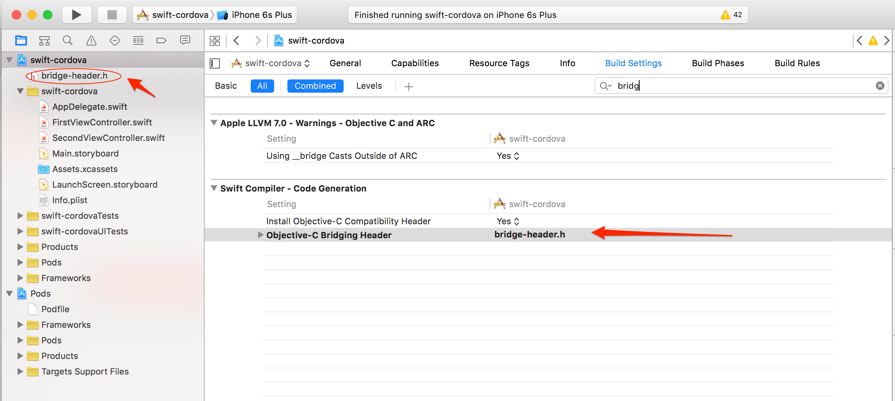

## phonegap-webview-ios

Resources and instructions for adding PhoneGap/Cordova-enabled WebViews into an iOS Native Project (Objective-C or Swift) quickly.

The [PhoneGap Docs - Embedded WebViews section](http://docs.phonegap.com/develop/1-embed-webview/ios/) has a full explanation of 
this approach and why you might want to consider it.   
  

### Quick Start Usage
1. Add the following to your native iOS project Podfile to get this dependency from the CocoaPods registry:	
		
		pod 'Cordova'
		pod 'phonegap-ios-template', :git => 'https://github.com/PeopleConnection/phonegap-webview-ios.git'
	
2. Install the pods referenced in the Podfile from the command line using the CocoaPods `pod` command:

		pod install
	
3. Close your native Xcode project and open the newly created `.xcworkspace` project in the same folder which now includes 
all of the Cordova dependency pods. 

4. You're ready to use any of the Cordova dependencies, for example the `CDVViewController`. See below for further details. 

### Detailed Usage - Embedding Cordova in a Native iOS Project
[Short Demo Video](https://www.youtube.com/watch?v=6_Gq_SwpNwg)

**NOTE:** This project assumes you have [previously installed CocoaPods](https://guides.cocoapods.org/using/getting-started.html) 

### Swift-Based Projects
As mentioned above, you can use Swift-based projects with Cordova using the same CocoaPods approach just described. You will need to add a bridging header
file when you want to start extending or using the Cordova classes (written in Objective-C) to allow you to communicate with Objective-C classes from your
Swift classes.

To set up a bridge header from Xcode:

1. Go to **File->New->File->Header File**, choose a name, and save it to the root of your Xcode project.  
2. Next you need to ensure the bridge header file name is set in the build settings for the project. To do so, click on the root of the project in the
navigator. Then in the **Build Settings** tab, look for the **Swift Compiler - Code Generation** section and enter your header file name 
for *Objective-C bridging header*. An example is shown below:

3. Now go back to your bridge header file and import the header files for the Cordova classes you wish to use in your project. For example:

          #ifndef bridge_header_h
          #define bridge_header_h
    
          #import "CDVViewController.h"
    
          #endif /* bridge_header_h */

4. Once the headers have been added to your bridging file, you can starting using them in your Swift code directly. For instance, in
a `ViewController.swift` file you might use something like the following to extend the `CDVViewController` class and resize the webview frame:
  
          import UIKit
          class SecondViewController: CDVViewController {  
              override func viewDidLoad() {
                   super.viewDidLoad()
                  // Do any additional setup after loading the view, typically from a nib.
              }
  
              override func didReceiveMemoryWarning() {
                  super.didReceiveMemoryWarning()
                  // Dispose of any resources that can be recreated.
              }
              override func viewWillAppear(animated: Bool) {                    
               super.viewWillAppear(true);             
               self.webView.frame = CGRectMake(
                   self.view.bounds.origin.x,
                   self.view.bounds.origin.y+40,
                   self.view.bounds.width,
                   self.view.bounds.height-40)
              }                  
          }          
